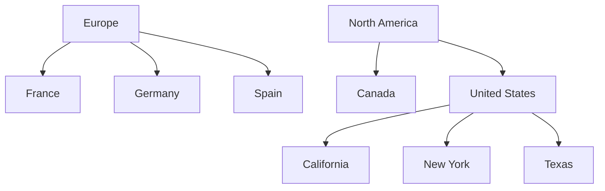

Palpabl NMS enables you to model your network's entire physical presence. This is accomplished through the `Organization` category of Netbox objects.

# Sites

The Sites category of objects are intended to enable you to properly represent your various locations and their purposes. 

## Regions

Regions represent geographic domains in which your network or end users have a presence. You should use these to model countries, states, and cities, though you can get much more granular if you desire.

Regions are self-nesting so you can define child regions within a parent, and grandchildren within each child. For example, you might consider a hierarchy like this:

Regions are always listed alphabetically by name within each parent, and there is no max depth for the hierarchy. 

## Site Groups 

Like regions, site groups can be arranged in a recursive hierarchy for grouping sites. However, site groups are intended for functional grouping whereas Regions are meant to communicate geographic organization.

Using both regions and site groups gives you two independent but complimentary dimenions in which you can organize your sites. 

## Sites

A site should be used to represent a building within a region or site group. Each site is assigned an operational status (active, planned, etc.) and can have a discrete mailing address and GPS coordinates assigned to it. 

## Locations 

A location can be any logical subdivision within a building, such as a floor or room. Like regions and site groups, locations can self-nest into a recursive hierarchy for maximum flexibility. And like sites, each location has an operational status assigned to it. 

---

# Tenancy

Tenancy allows you to represent customers or internal departments within your organization. 

## Tenants

Tenants are objects that are designed to represent a discrete groups of resources used for administrative purposes. You should use tenants to represent individual customers or internal departments within an organization. 

## Tenant Groups

Tenants can be organized by custom groups. For instance, you might create one group called "Customers" and one called "Departments", assigning tenants to these groups might be helpful to dileneate between which Tenant objects exist within your organization and which exist as customers of your organization. 

Tenant groups may be nested recursively to achieve a multi-level hierarchy. For example, you might have a group called "Customers" containing subgroups of individual tenants grouped by product or account team. 

---

# Contacts

The contacts feature enables you to create and assign contacts to individual objects in Palpabl NMS. This can be helpful in determining who is repsonsible for an individual switch or site and how to contact them. 

## Contact

A contact represents an individual or group that has been associated with an object for administrative reasons. For example, you might assign one or more operations contacts to each site. 

## Contact Group

Contacts can be organized into arbitrary groups. These groups can be recursively nested for convenience. Each contact within a group must have a unique name, but other attributes can be repeated. 

## Contact role

Contacts can be organized by functional roles, which are fully customizable. For example, you might create the roles administrative, operational, or emergency to dileneate between which contacts have what purpose. 

