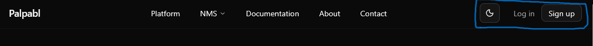
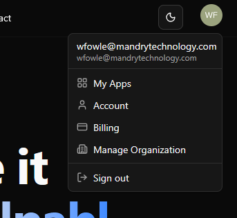
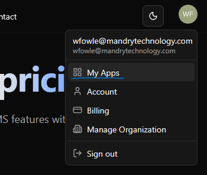
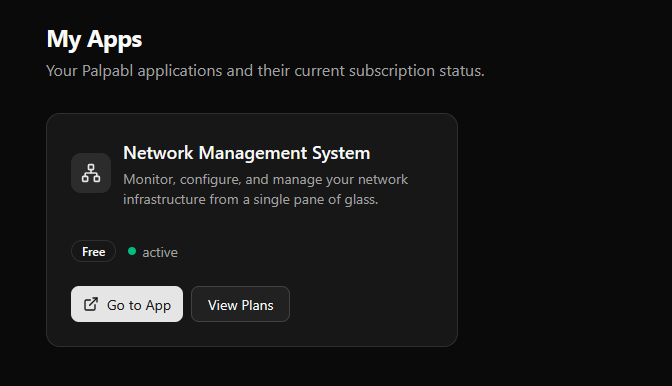

This guide is intended to assist you in getting started quickly with setting up Palpabl NMS. 

# Getting Signed Up 

First, you'll want to navigate to https://palpabl.com and login to your Palpabl account. If you do not have a Palpabl account you can sign up for one using the Sign-Up button on the top right of the page.

<Frame>
    
</Frame>

Once you are signed up and logged in the Login and Signup buttons will turn into a user avatar with a drop down. You can click this drop down to access key information with regards to your account. Such as *My Apps*, *Account*, *Billing* if you're a billing admin, and if you're an organization admin *Manage Organization*.

<Frame>
    
</Frame>

# Getting Started with a Palpabl NMS Plan

The Palpabl NMS product requires your organization to have a plan in order to use it. We offer several plans from *free* to *enterprise* plans. While our pricing page details what all features are offered with each of these plans some of these features are on a future road map for the product. Please keep this in mind when making purchasing decisions. 

You can find information on Palpabl NMS pricing and our plans [here](https://palpabl.com/products/nms/pricing).

From this page you can select which plan you would like to start. 

All plans for Palpabl NMS include an organization level license and do not require additional purchases to add additional users. 

<Note>
The ability to select a plan for your organization requires billing admin permissions.
</Note>

## How to Access The Application 

Once you have signed up for any of the Palpabl NMS plans you can access the application via the *My Apps* page. Once you're signed in you can access that page by clicking on your user drop down and selecting "My Apps".

<Frame>
    
</Frame>

The My Apps page shows applications in Palpabl that your organization has a subscription too, if you are not assigned permissions to this app you will still be able to access the app but it will show you an Unauthorized page if you don't have permission to access it. 

<Frame>
    
</Frame>

If you believe that you should have permissions to access the application you should reach out to your organization admin or have them [contact support](https://palpabl.com/contact) if you believe there is a technical issue. 

If the MyApps page doesn't show any applications please verify you have gone through the pricing page and started a plan. If you believe that there is an error please let us know [here](https://palpabl.com/contact).

# Billing 

For information on Billing see [this page](../platform/billing) which provides information on how the Palpabl platform handles billing.

