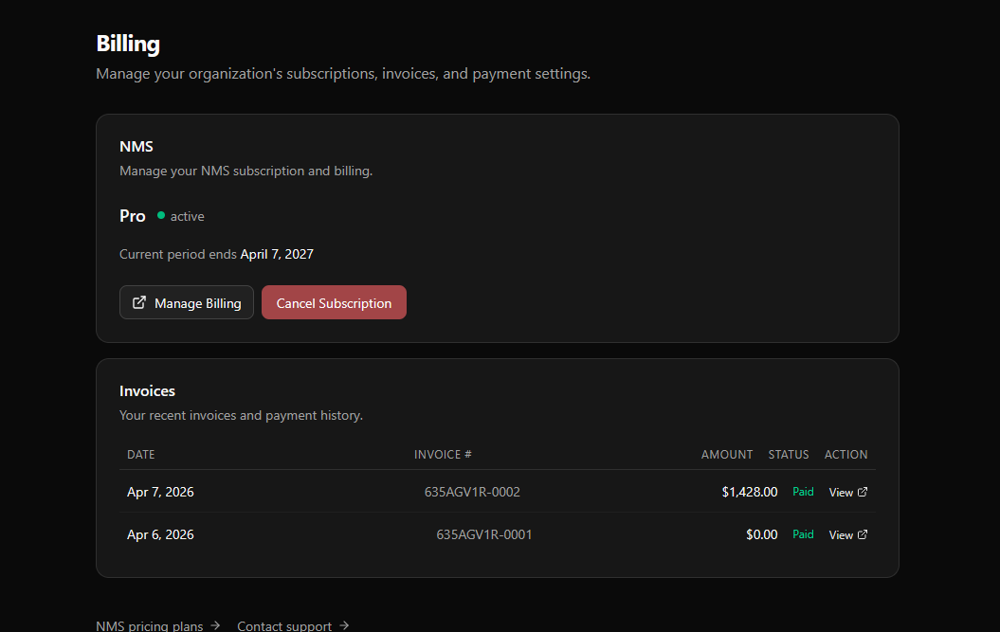

This page will show you how Palpabl Palpabl uses [Stripe](https://stripe.com/) to support our billing model and payment processing.

# Billing Page

You can access the billing page by using the user drop down and selecting the *Billing* menu item. 

<Note>
    In order to access the Billing menu you must be at least an *Organization Admin* or a *Billing Admin*.
</Note>

On the billing page you can see the relevant details of your subscriptions with Palpabl on a product by product basis. In our example image the user has a Pro subscription with the Palpabl NMS product. 

<Frame>
    
</Frame>

You can view and download relevant invoices from the Invoices section or change card details by selecting *Manage Billing*. You can also Cancel your subscription for any products by using the Cancel Subscription button. 