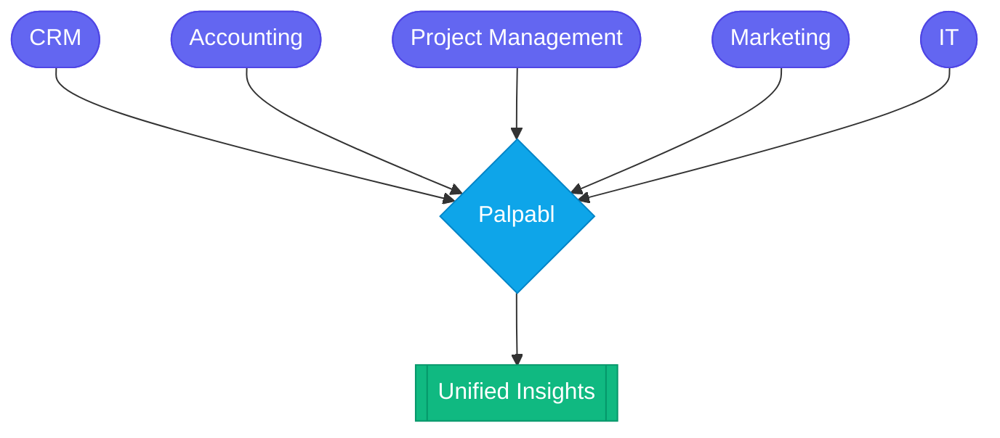

## What is Palpabl

Palpabl is a data aggregation platform that consolidates data across multiple domains into one pane of glass. Your goal in using Palpabl should be to connect the multiple tools you use to run your business so that you can gather meaningful insights across both of them. 

## Palpabl Products 

Currently Palpabl is in it's early development stage. Our only product that we offer for users to consume is the [Palpabl NMS](/nms/intro) (Network Management Solution). The reason we decided to start with Palpabl NMS is because as engineers our expertise already exists for network management as we have decades of experience doing it. 

In the future as we branch out from one business domain to another we're more than happy to add additional products and features within those products. 

Have a suggestion? We always love to hear from the community, you can submit your suggestions [here](https://palpabl.com/contact). 