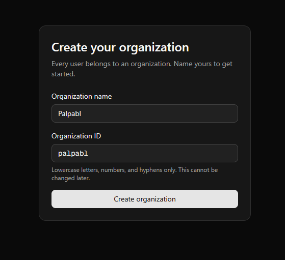
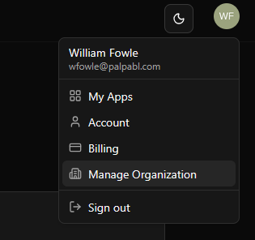
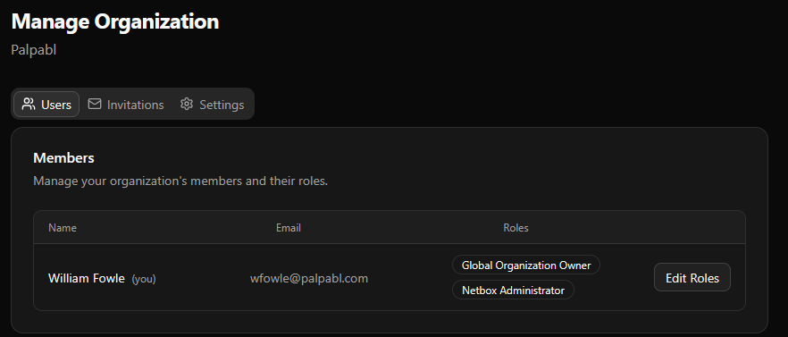
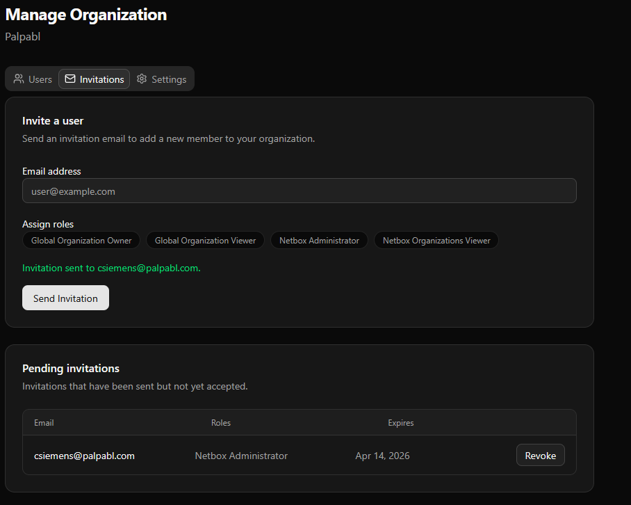

This page is intended to guide you on managing key aspects of managing your organization such as adding users, assigning roles, etc. 

# What is a Palpabl Organization?

A Palpabl organization is our platforms key attribute that dileneates a client and their users inside of the Palpabl platform. Users belong to an organization and their roles such as *Billing Admin*, *Netbox Administrator*, etc. are assigned at the organization level. 

<Note>In order to modify an organization you must have privelages associated with the *Organization Admin* role.</Note>

## How can I create an Organization?

In order to create an organization you must follow the steps to [sign up](platform/signup). During the sign-up once you have validated your email you will be asked to create an organization.

<Frame>
    
</Frame>

Once you've created your organization you'll be prompted to sign in using the credentials you setup in a previous step. 

Users are permitted to belong to multiple organizations however, you are only allowed to create one through the signup process. 

## Manage Users

If you have *Organization Owner* or *Organization Admin* privelages then you can manage your organization by clicking the Manage Organization drop down from the user drop down menu

<Frame>
    
</Frame>

From that menu you have several options that you can select from, the first and default menu is the Users menu. Under this menu you can manage users roles by clicking the Edit Roles button. 

<Frame>
    
</Frame>

<Note>
    There must always be at least one user that has the `Global Organization Owner` role. Palpabl will not allow you to remove that role from a user if they are the only user that has that role. 
</Note>

## Inviting Users to your organization 

You can invite users to your organization by using the Invitations menu. 

<Frame>
    
</Frame>

To invite a user type their email into the email address field and select which roles you would like to assign to them. When ready select the `Send Invitation` button. From there the user should recieve an email from Palpabl inviting them to your org. In order to join the user will have to accept the invitation from their email. 

In the pending invitations field you can use the revoke button to undo invitations that have not already been accepted. 

## Manage Organization Settings

Under the settings tab of the organizations management menu you can change the display name of your organization, as well as update the logo displayed during login for your organization. 